# Alp IDE — VS Code extension

First-class IDE support for projects built against the
[Alp SDK](https://github.com/alplabai/alp-sdk):

* **`board.yaml` LSP-native editing.** Inline diagnostics,
  completion, hover, symbols, quick fixes, and effective-config preview
  run through the language server.
* **`alp_project.py` loader commands.**  Generate Zephyr-conf /
  DTS overlay / CMake-args / Yocto-conf from `board.yaml` directly
  from the command palette.
* **`west` workflow wrappers** where build runs
  `validate board.yaml` -> `generate all` -> `west build`, plus
  dedicated `flash` / `run` wrappers with progress reporting.
* **Debug-aware orchestration.** Inspect, doctor, preflight,
  launch-profile planning, and support-bundle surfaces are available
  without embedding debugger implementation into the extension.

## Screenshots

### ALP IDE Hub

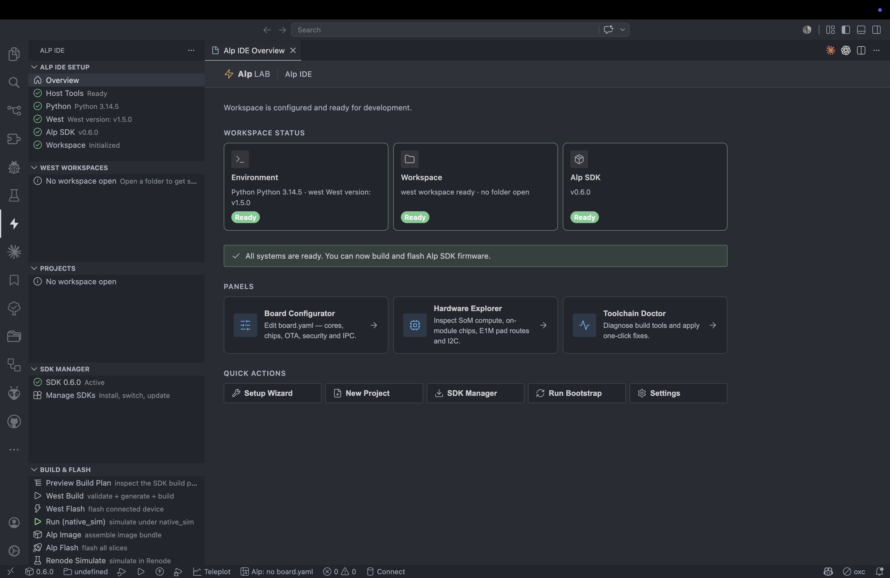

_Workspace readiness at a glance — environment, west workspace and Alp SDK status, board-configurator / hardware-explorer / toolchain-doctor panels, and quick actions._

### Create a new project

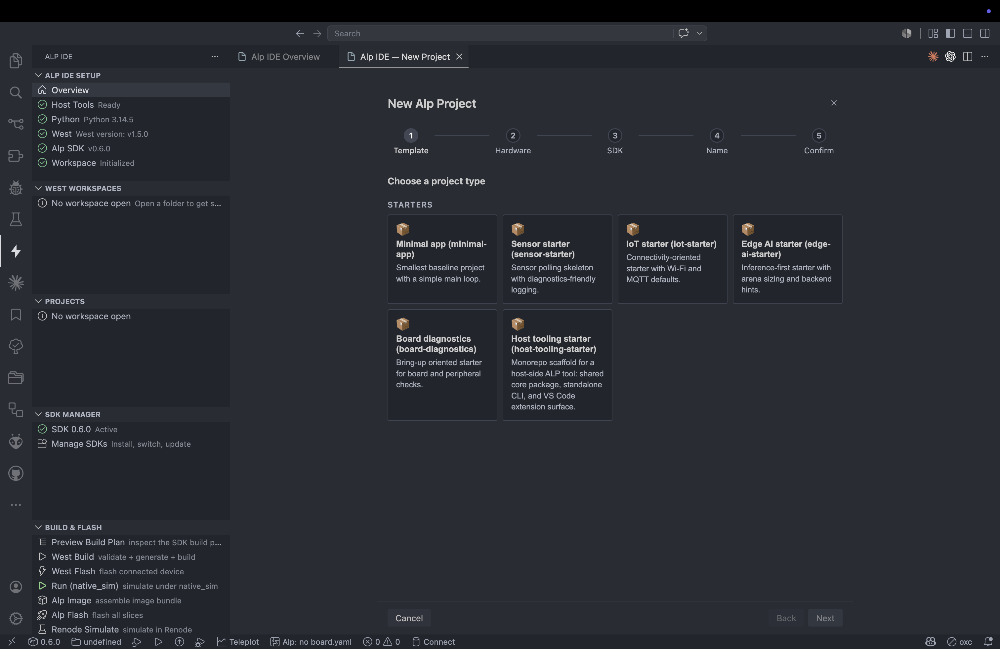

_Step 1 — pick a starter template: minimal, sensor, IoT, edge-AI, board-diagnostics, or host-tooling._

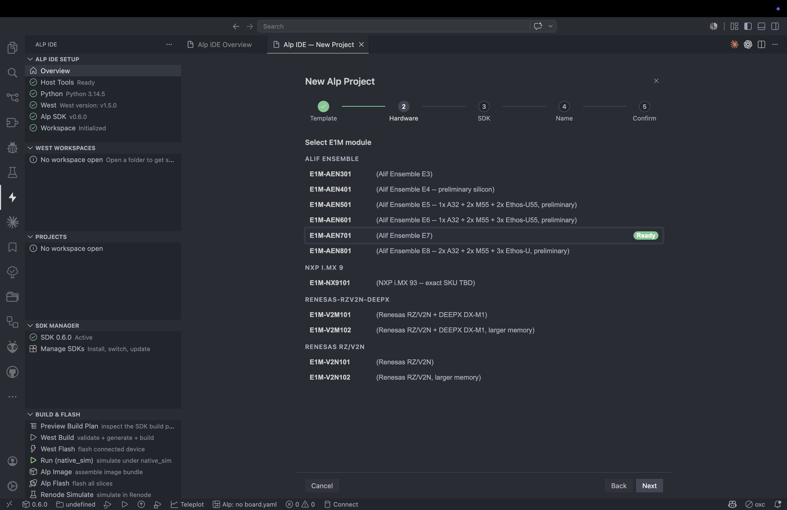

_Step 2 — choose the target E1M module, grouped by vendor (Alif Ensemble, NXP i.MX 9, Renesas RZ/V2N)._

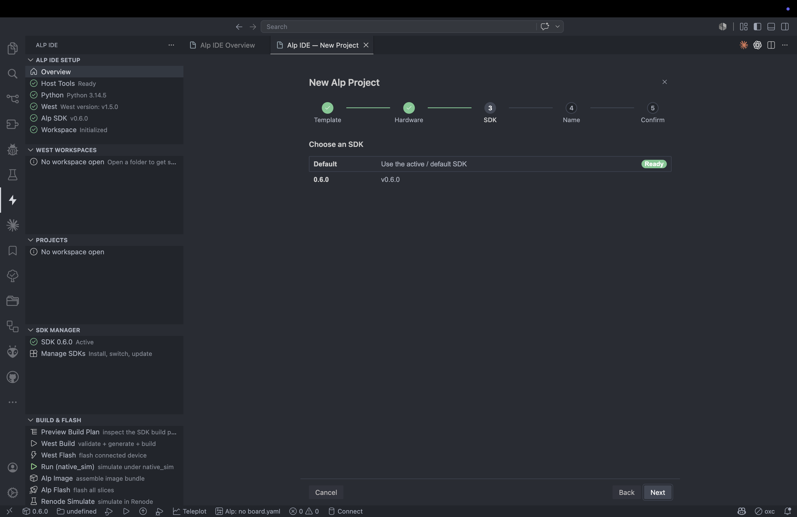

_Step 3 — scaffold against the active SDK or a pinned release._

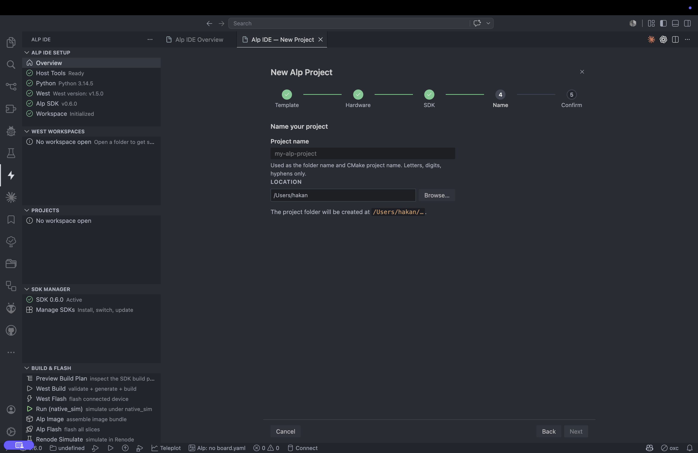

_Step 4 — name the project and choose its parent folder._

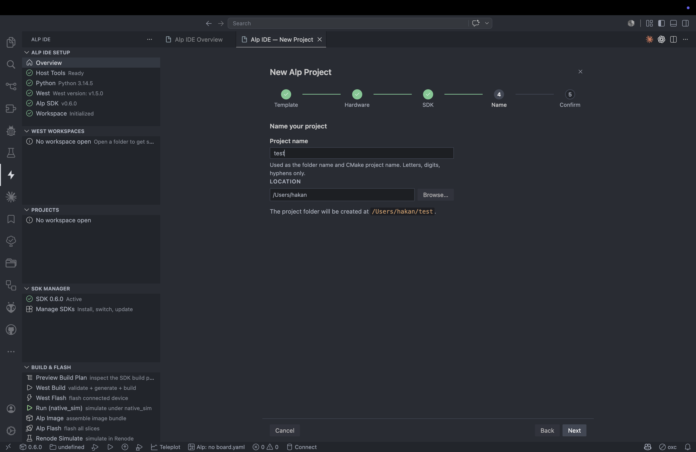

_The "will be created at …" path updates live as you type the project name._

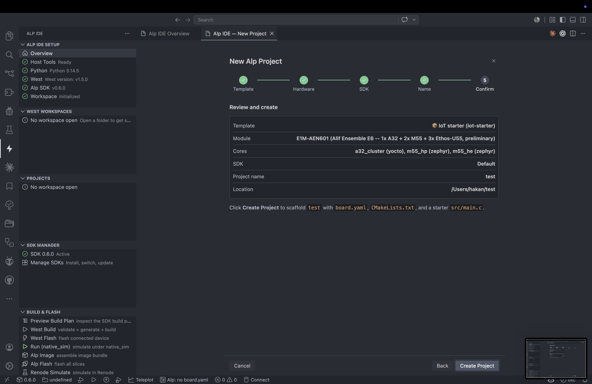

_Step 5 — review template, module, cores, SDK, name and location, then scaffold `board.yaml`, `CMakeLists.txt` and a starter `src/main.c`._

### Configure `board.yaml`

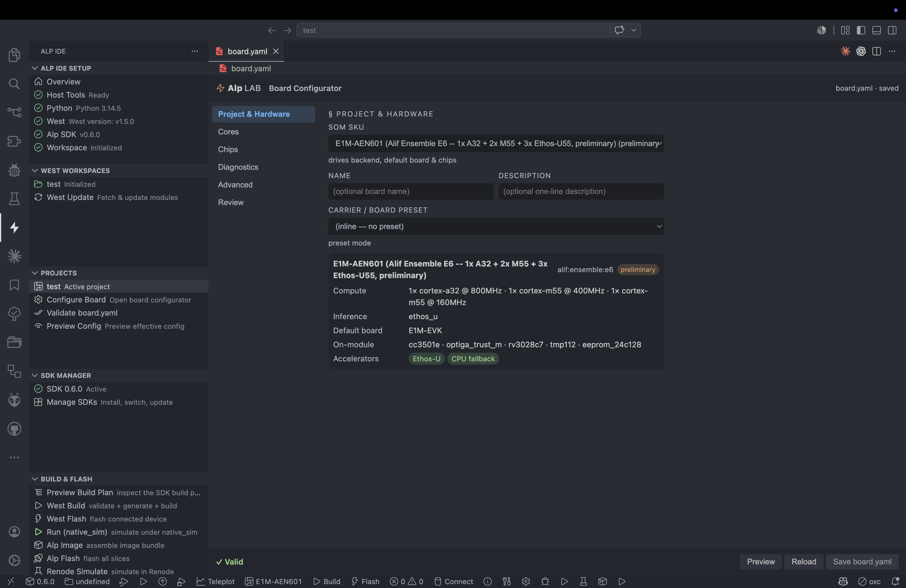

_Project & Hardware — SoM SKU, carrier/board preset, and the resolved compute/inference cores + on-module accelerators._

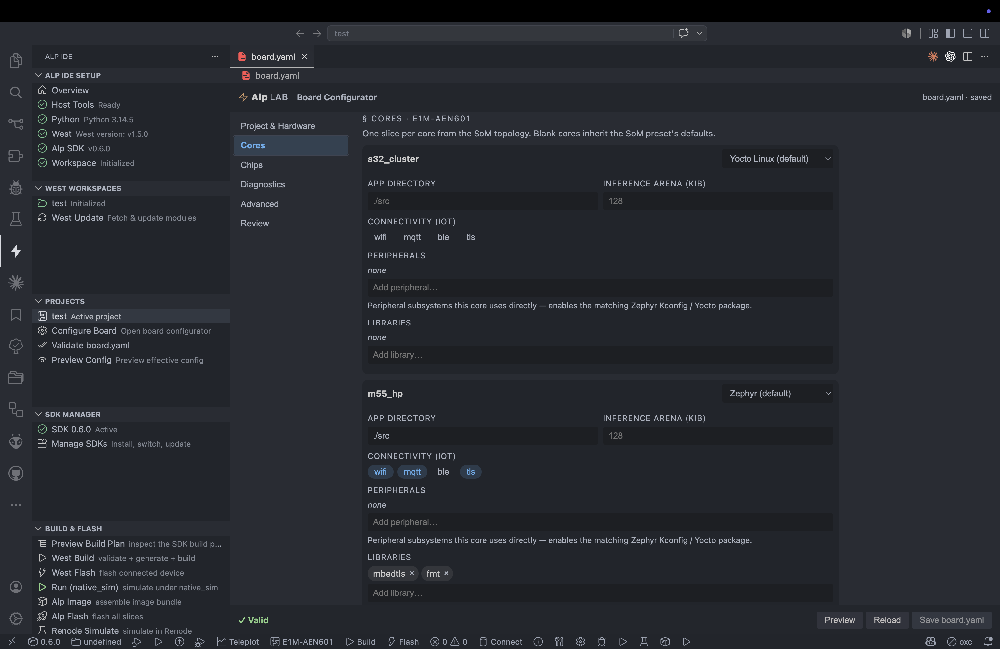

_Cores — per-core OS (Zephyr / Yocto), app directory, inference arena, connectivity, peripherals and libraries._

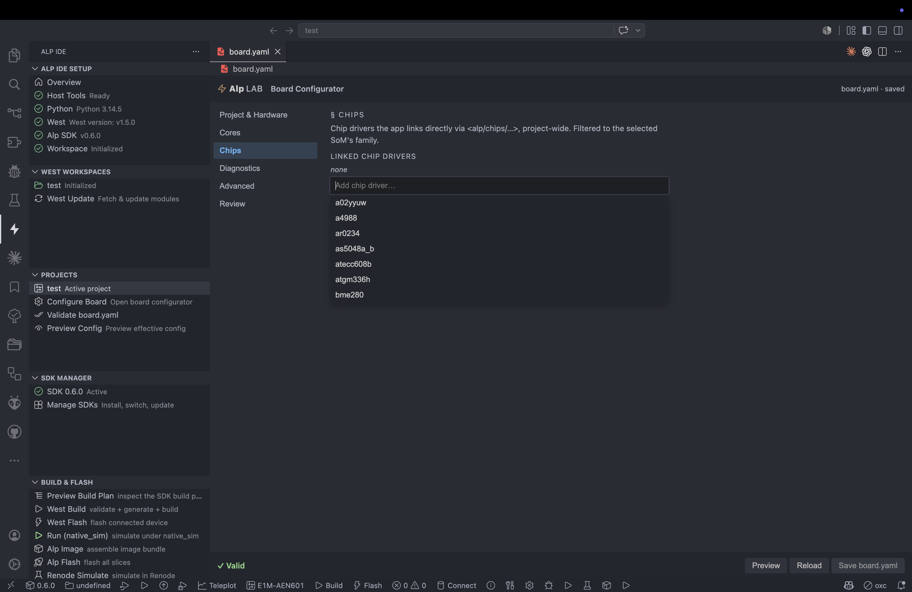

_Chips — link project-wide chip drivers, filtered to the selected SoM family._

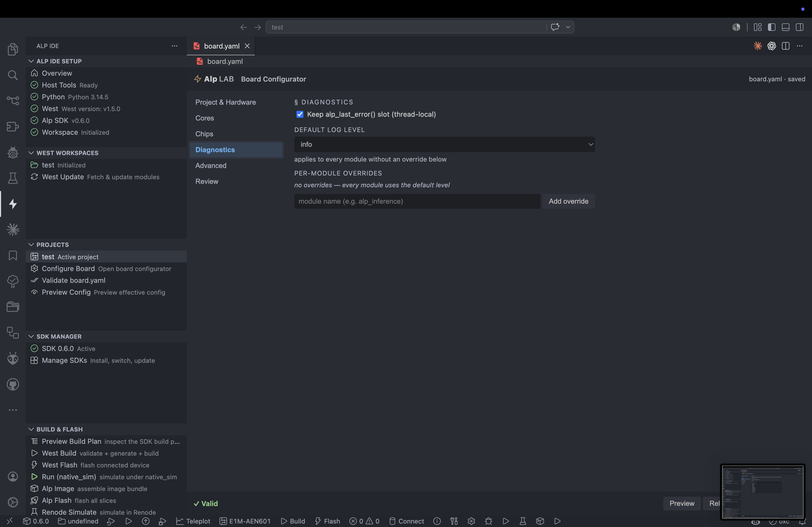

_Diagnostics — default log level, `alp_last_error()` storage, and per-module log-level overrides._

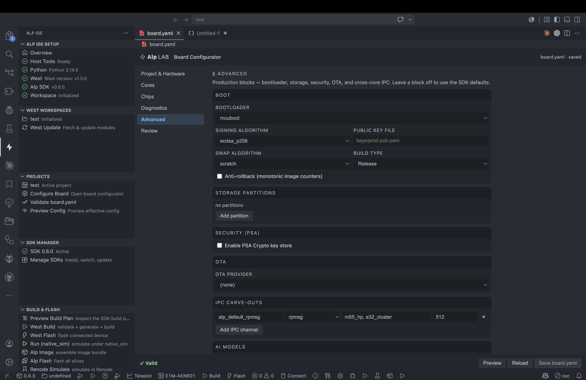

_Advanced — bootloader, image signing, storage partitions, PSA security, OTA provider, and inter-core IPC / RPMsg carve-outs._

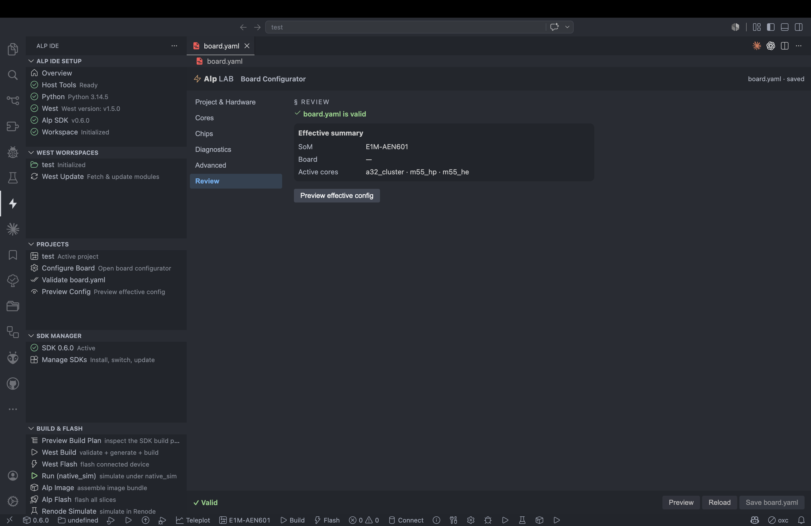

_Review — live "board.yaml is valid" with the effective SoM, board, and active cores._

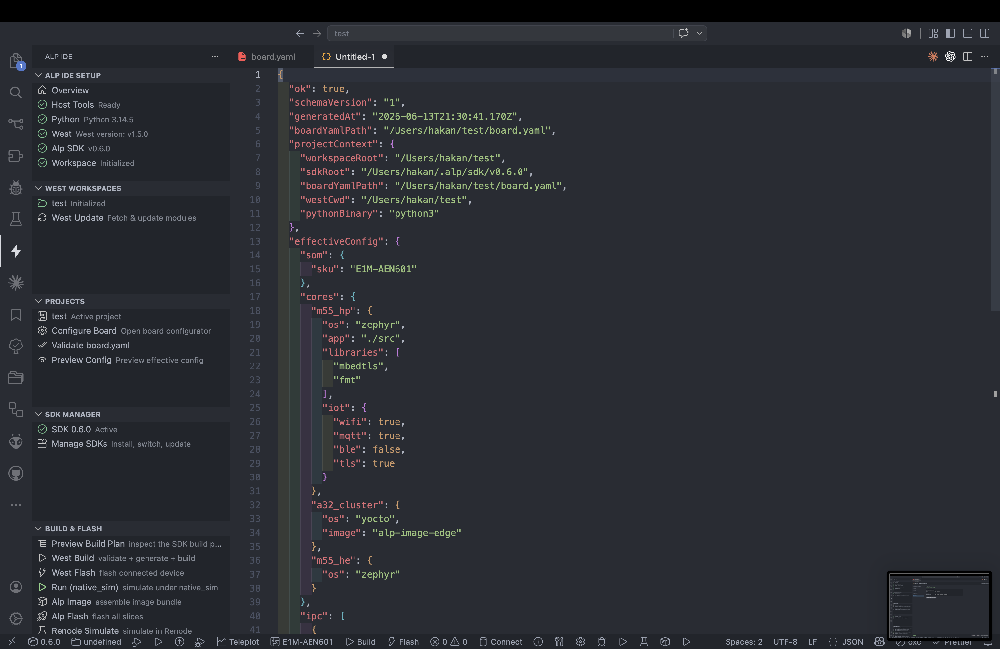

_Preview the resolved `projectContext` + `effectiveConfig` as JSON before building._

### Manage SDK releases

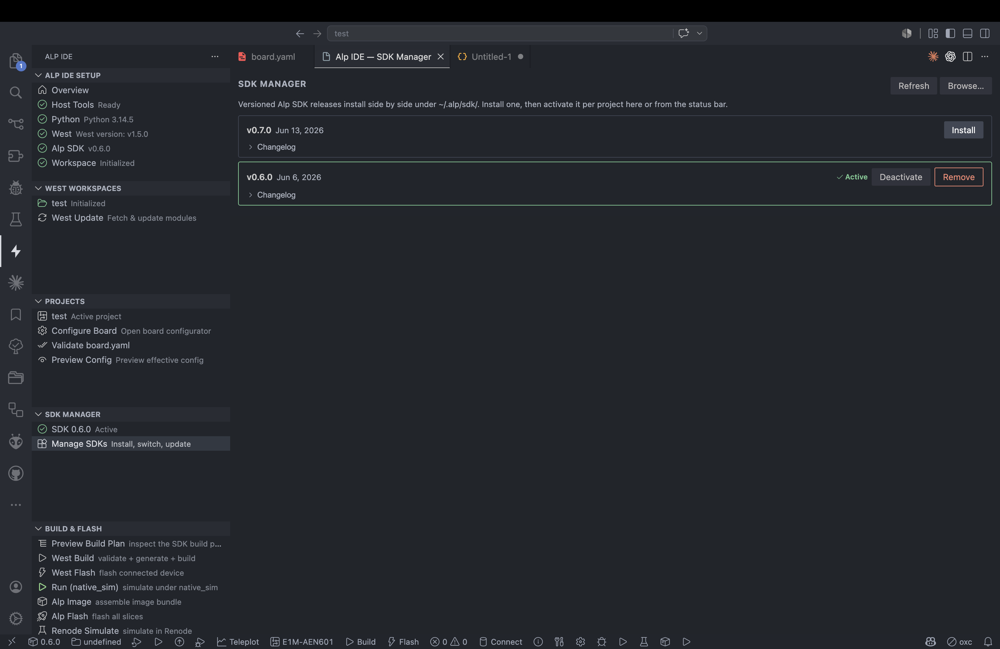

_List, install, activate and remove versioned Alp SDK releases, each with an expandable changelog._

## Install

VS Code Marketplace: search for "Alp SDK".  Or grab the latest
`.vsix` from the [Releases page](../../releases) and install via
`Extensions: Install from VSIX`.

## Repo layout

```text
.
├── README.md                -- this file (the only doc in the root)
├── CLAUDE.md                -- operating guide for AI agents (auto-loaded)
├── docs/                    -- all project docs (see "Documentation Map" below)
├── LICENSE                  -- Apache-2.0
├── package.json             -- VS Code extension manifest (workspace root)
├── pnpm-workspace.yaml      -- pnpm workspace config
├── tsconfig.json
├── packages/
│   └── alp-core/            -- @alp-sdk/core: shared domain logic
│       └── src/             -- board, configurator, sdk, wizard, ...
├── cli-rs/                  -- the native `alp` CLI (Rust; replaced packages/alp-cli)
├── src/                     -- VS Code extension TypeScript source
│   ├── README.md            -- source folder/module guide
│   ├── extension.ts         -- activation entry point
│   ├── bootstrap.ts         -- extension bootstrap and service wiring
│   ├── configuratorPanel.ts -- board.yaml panel surface
│   ├── diagnostics.ts       -- diagnostics surface wiring
│   ├── loader.ts            -- loader command surface
│   ├── debug.ts             -- debug command surface
│   ├── west.ts              -- west command surface
│   ├── statusBar.ts         -- status bar surface
│   ├── lsp/                 -- LSP client/server/service/commands
│   ├── validation/          -- validation plans and issue classification
│   ├── loader/              -- generation planning and execution contracts
│   ├── debug/               -- debug models and orchestration logic
│   ├── project/             -- workspace and toolchain context resolution
│   ├── boardSummary/        -- compact board summary parsing
│   ├── configurator/        -- board model parse/normalize/serialize
│   └── west/                -- west plan/orchestration logic
├── test/                    -- service and adapter-core unit tests
├── snippets/                -- board.yaml + main.c snippets
├── media/                   -- icons + walkthrough assets
└── alp-sdk-upstream/        -- git submodule -> alplabai/alp-sdk
                                (single source of truth for schemas)
```

## Documentation Map

- [ARCHITECTURE_RULES.md](docs/ARCHITECTURE_RULES.md): Layering,
  dependency direction, and testing contracts.
- [PLAN.md](docs/PLAN.md): Product goals and phased roadmap.
- [BACKLOG.md](docs/BACKLOG.md): Epic and issue checklist with current
  implementation state.
- [CLI.md](docs/CLI.md): Proposed CLI command families, output contract,
  and exit-code policy.
- [CI_EXAMPLES.md](docs/CI_EXAMPLES.md): GitHub Actions and GitLab CI
  examples for Alp CLI validation/generation/doctor flows.
- [GETTING_STARTED_VSCODE.md](docs/GETTING_STARTED_VSCODE.md): VS Code
  first-run workflow from install to validation and generation.
- [GETTING_STARTED_CLI.md](docs/GETTING_STARTED_CLI.md): CLI-first workflow
  for local terminal and CI usage.
- [EDITOR_FEATURES.md](docs/EDITOR_FEATURES.md): LSP/editor capabilities for
  board.yaml authoring.
- [GENERATION_OUTPUTS.md](docs/GENERATION_OUTPUTS.md): Generation targets,
  output paths, and deterministic output expectations.
- [SOURCE_SCAFFOLDING.md](docs/SOURCE_SCAFFOLDING.md): Project bootstrap and
  module scaffolding workflows.
- [TROUBLESHOOTING_VALIDATION.md](docs/TROUBLESHOOTING_VALIDATION.md):
  Validation failure diagnosis and recovery flow.
- [TROUBLESHOOTING_GENERATION_CONFLICTS.md](docs/TROUBLESHOOTING_GENERATION_CONFLICTS.md):
  Generation/scaffolding conflict handling and overwrite safety.
- [TROUBLESHOOTING_ENVIRONMENT.md](docs/TROUBLESHOOTING_ENVIRONMENT.md):
  Runtime/toolchain troubleshooting for CLI and VS Code workflows.
- [TASK_RECIPES.md](docs/TASK_RECIPES.md): Common GUI/CLI task mapping for
  daily workflows.
- [TEST_MATRIX.md](docs/TEST_MATRIX.md): Test coverage map by surface and
  test type.
- [COMPATIBILITY_RULES.md](docs/COMPATIBILITY_RULES.md): Backward
  compatibility guarantees for schema, generation targets, and CLI
  contracts.
- [RELEASE_GATES.md](docs/RELEASE_GATES.md): Required release checks for
  core, LSP, UI, CLI, and docs.
- [PERFORMANCE_BUDGETS.md](docs/PERFORMANCE_BUDGETS.md): Performance
  budgets and regression-check guidance.
- [DEBUG.md](docs/DEBUG.md): Debug support matrix and launch strategy.
- [CONTRIBUTING.md](docs/CONTRIBUTING.md): Dev setup, the CLI release flow, and
  rollback playbook.
- [EXTENSION_CLI_INTEGRATION.md](docs/EXTENSION_CLI_INTEGRATION.md): How the
  extension consumes the native `alp` CLI (binary resolution + the in-process vs
  delegated split).
- [BUILD_ORCHESTRATION.md](docs/BUILD_ORCHESTRATION.md): Wave C plan — the `alp`
  CLI drives the build (materialise/execute/schedule/cache/UX) and wraps
  `west`/`bitbake`/`cmake` directly, **consuming** the SDK's
  `alp_orchestrate.py --emit build-plan` instead of re-implementing the planner;
  the consumed `BuildPlan` contract, parity strategy, and phased rollout.
- [PROPOSAL-alp-build-core.md](docs/PROPOSAL-alp-build-core.md): the team-to-team
  agreement record — the settled CLI/SDK split, why we consume `--emit
  build-plan`, and the SDK's committed contract seams.
- [ALP_IDE_ONBOARDING.md](docs/ALP_IDE_ONBOARDING.md) /
  [ALP_IDE_SDK_INSTALLATION.md](docs/ALP_IDE_SDK_INSTALLATION.md): IDE Hub
  onboarding and SDK install flows.
- [src/README.md](src/README.md): Source module map.
- [src/lsp/README.md](src/lsp/README.md): LSP module responsibilities.
- [src/debug/README.md](src/debug/README.md): Debug module boundaries.
- [src/loader/README.md](src/loader/README.md): Loader module responsibilities.
- [src/validation/README.md](src/validation/README.md): Validation module ownership.
- [src/project/README.md](src/project/README.md): Workspace/toolchain context rules.
- [src/wizard/README.md](src/wizard/README.md): First-run project wizard responsibilities.

## Why a separate repo

The extension previously lived at `alp-sdk/vscode/`.  Split out
because:

* **Different toolchain.**  TypeScript + esbuild + vsce against
  Node 18+; nothing in common with the SDK's CMake / Zephyr /
  Yocto build context.
* **Different release cadence.**  VS Code Marketplace releases
  follow extension-side changes; SDK quarterly tags lag.
* **Different contributors.**  Some folks build extensions, some
  build firmware -- splitting lowers the barrier for the former.

The alp-sdk consumer still gets a one-line install via the
Marketplace; no functionality changed.

## Schema-sync

The extension's schema-aware validation uses a **vendored** copy of the board
schema at `schemas/board.schema.json` (so it ships inside the VSIX —
`alp-sdk-upstream/**` is excluded from the package). It is derived from the
alp-sdk submodule's board schema; `package.json::contributes.yamlValidation.url`
points at the vendored path. Its presence + structure (`$id`, `required`) are
enforced by `test/board.schema.vendored.test.js` and the CI "vendored schema"
check.

> **Schema v2 (alp-sdk v0.6+):** `board.yaml` now uses `schema_version: 2`
> with a per-core `cores:` block replacing the top-level `os:` field.
> Use the `alp-board-min` or `alp-board-hetero` snippet to get a
> valid starting point.

When alp-sdk bumps the schema:

```bash
cd alp-sdk-upstream
git fetch && git checkout main
cd ..
cp alp-sdk-upstream/metadata/schemas/<board-schema>.json schemas/board.schema.json  # re-vendor
git add alp-sdk-upstream schemas/board.schema.json
git commit -m "deps(alp-sdk): bump submodule to <sha> + re-vendor schema"
pnpm test         # re-runs the schema-snapshot tests
pnpm run package  # builds the .vsix against the new schema
```

## Build

```bash
git clone --recurse-submodules https://github.com/alplabai/alp-sdk-vscode.git
cd alp-sdk-vscode
pnpm install
pnpm run compile    # tsc -> out/ (extension) + webview (vp build)
pnpm test           # compile + lightweight service / adapter tests
pnpm run package    # vsce package -> alp-sdk-<version>.vsix
```

Load the local build via `Extensions: Install from VSIX`.

## Development

Use `pnpm test` as the default verification step while changing the
extension.

The current test setup is intentionally lightweight:

* pure service modules are tested directly
* thin adapter seams with injected dependencies are tested without
  booting VS Code
* compile stays part of the test run so API drift is caught early

When changing architecture-sensitive code, prefer keeping this split:

* `service` for pure decision logic
* `vscodeAdapter` for VS Code, filesystem, and subprocess access
* `adapterCore` for runtime-independent seam logic
* surface files such as commands, panels, status bar, and diagnostics
  for presentation and orchestration only

For the full implementation contract, see
[ARCHITECTURE_RULES.md](docs/ARCHITECTURE_RULES.md).

For slice-level ownership and file conventions, see
[src/README.md](src/README.md) and each module-local README.

## License

Apache-2.0, same as the SDK.
